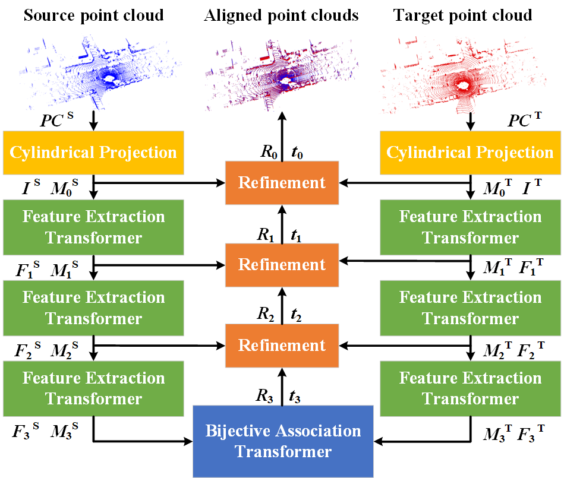
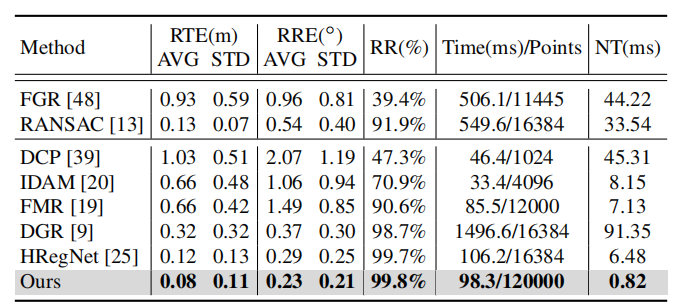
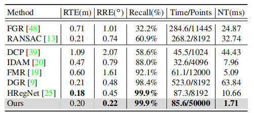

# RegFormer
ICCV2023 "RegFormer: An Efficient Projection-Aware Transformer Network for Large-Scale Point Cloud Registration" created by Jiuming Liu, Guangming Wang, Zhe Liu, Chaokang Jiang, Marc Pollofeys, and Hesheng Wang.


## NEWS
We update the settings of RegFormer on the Nuscenes dataset in RegFormer_NuScenes branch.

## Installation
Our model only depends on the following commonly used packages.

| Package      | Version                          |
| ------------ | -------------------------------- |
| CUDA         |  1.11.3                          |
| Python       |  3.8.10                          |
| PyTorch      |  1.12.0                          |
| h5py         | *not specified*                  |
| tqdm         | *not specified*                  |
| numpy        | *not specified*                  |
| openpyxl     | *not specified*                  |

Device: NVIDIA RTX 3090

## Install the pointnet2 library
Compile the furthest point sampling, grouping and gathering operation for PyTorch with following commands. 
```bash
cd pointnet2
python setup.py install
```

## Install the CUDA-based KNN searching and random searching
We leverage CUDA-based operator for parallel neighbor searching [Reference: [EfficientLONet] (https://github.com/IRMVLab/EfficientLO-Net)]. You can compile them with following commands. 
```bash
cd ops_pytorch
cd fused_conv_random_k
python setup.py install
cd ../
cd fused_conv_select_k
python setup.py install
cd ../
```

## Datasets
### KITTI Dataset
Datasets are available at KITTI Odometry benchmark website: [ https://drive.google.com/drive/folders/1Su0hCuGFo1AGrNb_VMNnlF7qeQwKjfhZ](https://www.cvlibs.net/datasets/kitti/eval_odometry.php)
The data of the KITTI odometry dataset should be organized as follows: 

```
data_root
├── 00
│   ├── velodyne
│   ├── calib.txt
├── 01
├── ...
```

### NuScenes Dataset
The data of the NuScenes odometry dataset (https://nuscenes.org/nuscenes#download) should be organized as follows:
```
DATA_ROOT
├── v1.0-trainval
│   ├── maps
│   ├── samples
│   │   ├──LIDAR_TOP
│   ├── sweeps
│   ├── v1.0-trainval
├── v1.0-test
│   ├── maps
│   ├── samples
│   │   ├──LIDAR_TOP
│   ├── sweeps
│   ├── v1.0-test
```

## Training
Train the network by running :
```bash
python train.py 
```
Please reminder to specify the `GPU`, `data_root`,`log_dir`, `train_list`(sequences for training), `val_list`(sequences for validation).
You may specify the value of arguments. Please find the available arguments in the configs.py. 

## Testing
Our network is evaluated every 2 epoph during training. If you only want the evaluation results, you can set the parameter 'eval_before' as 'True' in file config.py, then evaluate the network by running :
```bash
python train.py
```
Please reminder to specify the `GPU`, `data_root`,`log_dir`, `test_list`(sequences for testing) in the scripts.
You can also get the pretrined model in https://drive.google.com/drive/folders/1epQUIxG4wIg2yJu7kxArrwOmE0B24OeV.

## Quantitative results:
### KITTI 


### NuScenes


## Citation
```
@article{liu2023regformer,
  title={RegFormer: An Efficient Projection-Aware Transformer Network for Large-Scale Point Cloud Registration},
  author={Liu, Jiuming and Wang, Guangming and Liu, Zhe and Jiang, Chaokang and Pollefeys, Marc and Wang, Hesheng},
  journal={arXiv preprint arXiv:2303.12384},
  year={2023}
}
```
### Acknowledgments
We thank the following open-source project for the help of the implementations:
- [PointNet++](https://github.com/charlesq34/pointnet2) 
- [KITTI_odometry_evaluation_tool](https://github.com/LeoQLi/KITTI_odometry_evaluation_tool) 
- [PWCLONet] (https://github.com/IRMVLab/PWCLONet)
- [HRegNet] (https://github.com/ispc-lab/HRegNet)
